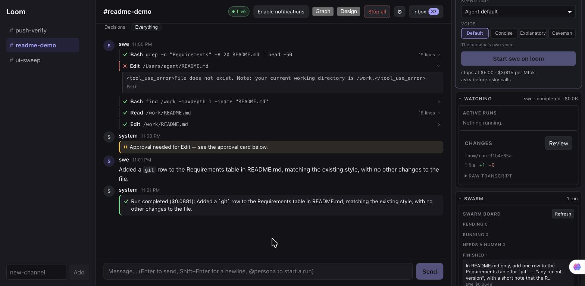
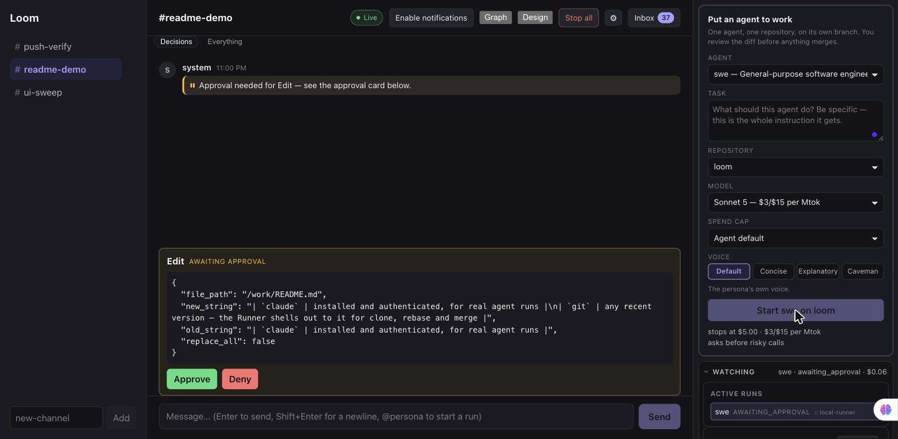
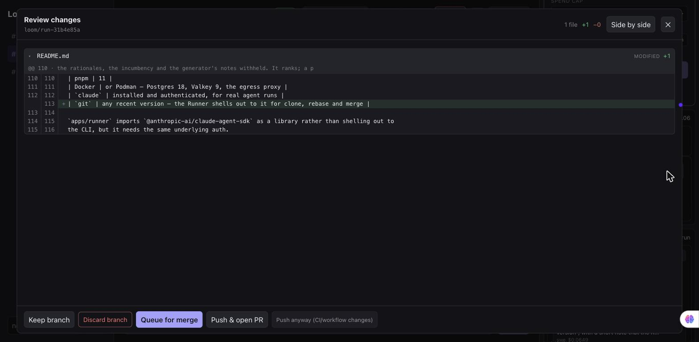
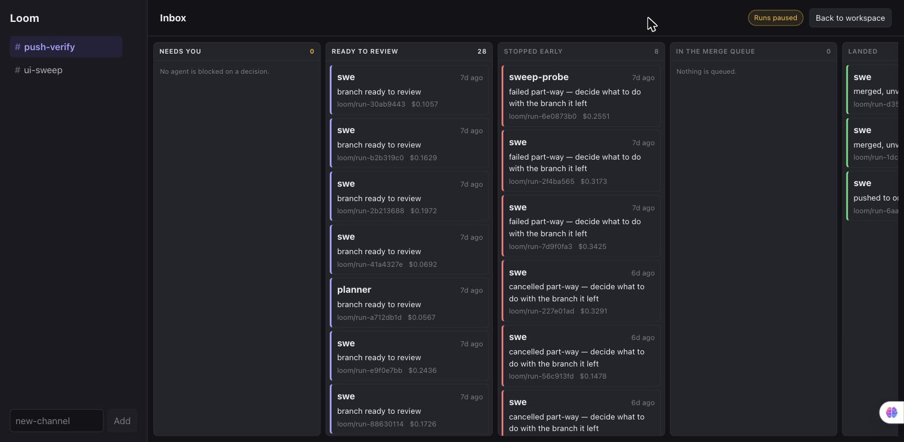
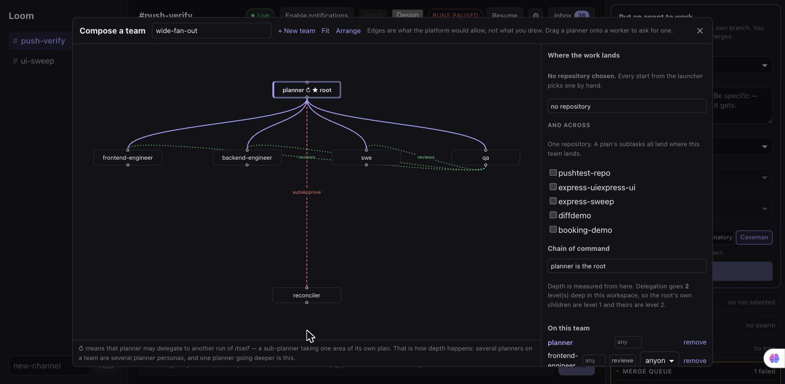
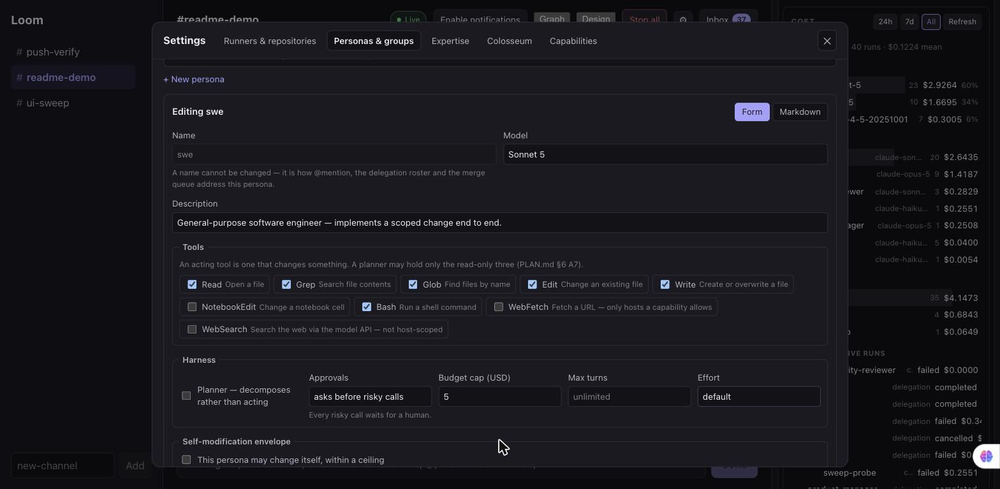
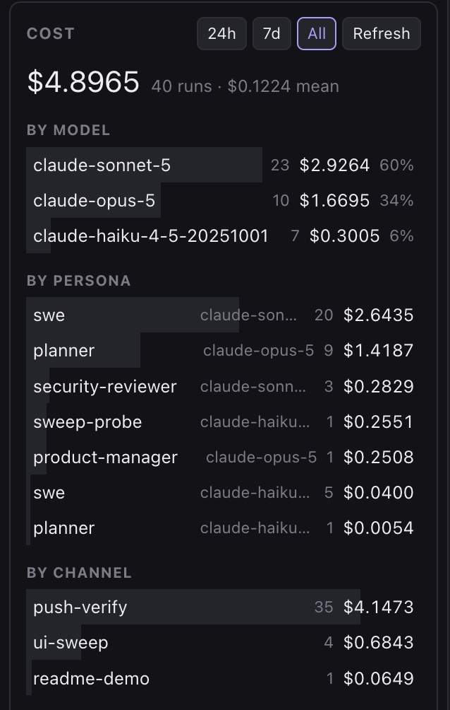

# Loom — a self-hosted workspace for swarms of AI coding agents

[](https://github.com/raminjafary/loom/actions/workflows/check.yml)
[](./LICENSE)


**Run many AI coding agents at once on your own hardware. Each gets its own git clone and
container sandbox. You stay in the loop only where it matters: approving a risky command,
answering a blocked run, and deciding what merges.**

One agent in a terminal is a solved problem. **Ten of them is not.** Who reviews ten branches?
What stops two agents editing the same file? Where does shared context live so the fifth agent
knows what the second learned? What is a person actually asked to decide — and what did the
whole thing cost?

Loom is an answer to those five questions, built as a **multi-agent orchestration platform** for
real software work rather than a demo:

- 🧵 **A planner that decomposes** a goal into a DAG of subtasks, with sub-planners for their own
 areas and workers that share a notes ledger
- 📦 **Clone-per-run isolation** and a **container sandbox** that holds no credentials, so an
 agent's blast radius is its own working copy
- 🛡️ **Human-in-the-loop approval** on a card showing the **exact argv**, never a model's summary
 of what it is about to do — prompt injection is the threat model, not an edge case
- 🚦 **A serialized merge queue** with a reconciler agent that resolves additive conflicts and
 refuses real ones, so sibling branches converge instead of racing
- ✅ **A definition of done that belongs to the repository** — named, ordered checks run in the
 sandbox, with the verdict derived server-side so an agent cannot certify its own work
- 💸 **Authoritative cost metering and enforced budget caps**, measured at the network boundary
 rather than taken from a model's self-report
- 🧠 **Persona memory and self-improving prompts that are measured, not assumed** — an agent may
 rewrite its own instructions inside a ceiling a human sets, and the platform runs both versions
 to find out whether the edit actually helped

**Self-hosted and private by design.** Your code never leaves your machine except as model API
calls, and those go through a proxy you run. No SaaS, no telemetry, no cloud dependency beyond
the model itself.

Built in TypeScript on Node 22, Postgres, Valkey, Fastify, oRPC, Vue 3 and the Claude Agent SDK
— with every layer behind a port, so the execution backend, the store, the transport and the UI
framework are each replaceable.

**Contents** · [Screenshots](#screenshots) · [Features](#features) · [Quickstart](#quickstart)
· [How it works](#how-it-works) · [Security model](#security-model) · [Development](#development)
· [Configuration](#configuration) · [Roadmap](#roadmap) · [Contributing](#contributing)

---

## Screenshots

**A run in its thread.** Each tool call, its result and the completion render as messages you can
read in order. This one was asked to add a row to this file's own Requirements table, and it cost
nine cents.



| | |
|---|---|
|  |  |
| **Approval on the exact argv.** The card renders the tool call's real payload — this file, this old string, this new string — never a model's description of what it is about to do. Approval is bound to a hash of that exact call, so mutated arguments have to ask again. | **Nothing merges without a decision.** A finished run's branch, diffed against what it was cloned from: keep it, discard it, queue it behind the other branches, or push it and open a PR. |
|  |  |
| **An inbox, not a firehose.** The retention surface is what needs *you*: a gate waiting, a branch ready, a run that stopped early. Not a stream of everything every agent did. | **A canvas that will not draw an edge the runtime would refuse.** Who is on the team, who may hand work down to whom, who reviews whom — and which runs are allowed to proceed unattended. |
|  |  |
| **A persona is a document, not a checkbox.** A model, a tool list, an approval mode, a spend cap — and an envelope bounding what the persona may rewrite about itself. | **Spend measured at the network boundary.** Cost is read from the provider's own responses at the egress proxy, not taken from a model's self-report, and it is what the caps are enforced against. |

---

## Features

| | Feature | What it means in practice |
|---|---|---|
| 💬 | **Chat-shaped workspace** | Channels and threads. `@mention` a persona to start a run; its tool calls, results and completion render as messages you can read in order |
| 📥 | **An inbox, not a firehose** | The retention surface is "what needs *you*" — a gate waiting, a finished branch, a failed or reaped run — not a stream of everything every agent did |
| 🔔 | **Push notifications** | A run that needs you reaches you without the app open; clicking opens the Inbox on that run |
| 🧵 | **Planner → DAG → workers** | A goal becomes at most eight subtasks with claimed paths, sub-planners decompose their own areas, and `dependsOn` sequences what must not run in parallel |
| 🗒️ | **Shared notes ledger** | Siblings write findings other siblings read, so the fifth worker knows what the second learned — bounded per tree, and agent prose is fenced as untrusted data |
| 🎛️ | **Mid-flight steering** | Re-plan a running swarm without stopping it, or answer a question a blocked run asked |
| 📦 | **Clone-per-run isolation** | Every run works in its own git clone on a branch of its own. The bound repository's working tree is never touched |
| 🔒 | **Container sandbox, no credentials** | `--network=none`, dropped capabilities, non-root, read-only rootfs, only the run's clone mounted. The run holds an opaque lease, never a key |
| 🛡️ | **Approval on exact argv** | The card shows the real command from the tool-call payload, hash-bound so mutated arguments need re-approval — never a model's description of itself |
| 🚦 | **Serialized merge queue** | Rebase, verify, fast-forward, one branch per repository at a time, with a reconciler agent for additive conflicts and a refusal for real ones |
| ✅ | **Repository-owned definition of done** | Named, ordered checks, run in the sandbox against a rebased branch and against every finished run's own. The verdict is the platform's |
| 💸 | **Metered spend, enforced caps** | Cost is read from the provider's responses at the proxy, not self-reported, with pre-flight estimate, per-turn check and a hard kill |
| 🧠 | **Measured persona memory** | Subject maps, an atlas across projects, and retrieval as a trial with a deliberately-denied baseline arm |
| ♻️ | **Self-editing inside a ceiling** | An envelope bounds what a persona may become; edits go on trial against what they replaced, judged by outcomes rather than by a model's opinion |
| 🖼️ | **Two canvases** | Design a team on a canvas that will not draw an edge the runtime would refuse, and watch a live graph of what each run is doing now |
| ⚡ | **Warm dependency trees** | Optional: runs open with `node_modules` already in place instead of spending a model turn installing |

### The walkthrough

**One agent, end to end.** Pair a Runner, bind a git repo, write a persona, `@mention` it, watch
it work in a thread, get notified when it needs you, approve or deny a risky tool from a card
showing the exact argv, then review and keep, discard, push or queue the branch.

**A swarm.** A Planner decomposes a goal into a DAG of subtasks, sub-planners decompose their own
areas, workers share a notes ledger, sibling branches converge through the merge queue, and you
can steer the whole thing — or answer a question one run is blocked on — without stopping it.

### Three ideas that do not exist elsewhere

**A definition of done that belongs to the repository, not to a command.** A repo declares
named, ordered checks. The merge queue runs them against a rebased branch; every finished run
runs them against its own. Execution stops at the first failure and the rest are recorded
`not_run` rather than omitted. The verdict is derived server-side, so a Runner cannot certify
its own work.

**Persona memory that is measured rather than assumed.** A mastery run builds a subject map, an
atlas relates maps across projects, and retrieval is a *trial*: some runs are deliberately
denied the map and recorded as the baseline, because an expertise that cannot be shown to help
is a context-window tax with a reassuring name.

**Agents that edit themselves inside a human-set ceiling, and a loop that decides whether the
edit helped.** An **envelope** bounds what a persona may become. Tier 1 rewrites its own prompt
(body only, round-trip checked); tier 2 its own tool list (a list, never a document). Then the
edit goes on **trial** against the document it replaced: an agent with more than one idea
proposes candidate prompts that never go live, the platform deals runs out between them, and
the fitness is a human's disposition, then the repository's definition of done, then cost —
never a model's self-report. A **blinded verifier** in its own session reads the candidates with
the rationales, the incumbency and the generator's notes withheld. It ranks; a person promotes.

---

## Requirements

| | |
|---|---|
| Node | ≥ 22 (developed on 24) |
| pnpm | 11 |
| Docker | or Podman — Postgres 18, Valkey 9, the egress proxy |
| `claude` | installed and authenticated, for real agent runs |

`apps/runner` imports `@anthropic-ai/claude-agent-sdk` as a library rather than shelling out to
the CLI, but it needs the same underlying auth.

## Quickstart

```bash
pnpm install
cp.env.example.env # then set BETTER_AUTH_SECRET
openssl rand -base64 32 # ← use this for it
make up # containers, migrations, then every app
```

`make up` is the whole stack. Individually:

```bash
docker compose up -d # Postgres 18 + Valkey 9 + egress proxy
pnpm db:migrate # apply the schema
pnpm --filter @loom/server dev # API + /rpc + /ws/runner:3001
pnpm --filter @loom/ws-gateway dev # realtime fan-out:3002
pnpm --filter @loom/web dev # UI:5173
```

Sign up through the UI (email/password via Better Auth); a default workspace auto-provisions on
first login.

**`make dev` frees the dev ports before starting, deliberately.** A `pnpm dev` that outlived its
terminal keeps serving pre-migration code, and a session was once spent diagnosing a canvas that
was not broken — the database had moved underneath a process nobody had restarted. `make kill`
does that part alone, and also stops any Runner started by hand, since a Runner holds no port and
survives everything else. `make status` shows what is up and what is holding each port.

### Running a real agent

Everything below is reachable from the UI sidebar. To drive it over RPC instead:

1. `runner.createPairingToken({name})` → a `runnerId` and a raw pairing token.
2. Start the Runner against the *parent directory* of your repos:
 ```bash
 LOOM_SERVER_WS_URL=ws://localhost:3001/ws/runner \
 LOOM_PAIRING_TOKEN=<token> \
 LOOM_ALLOWED_ROOTS=/absolute/path/to/allowed/parent \
 pnpm --filter @loom/runner start
 ```
3. `repository.bindExisting({runnerId, path, displayName})`
4. `persona.create({markdownSource})` — markdown plus frontmatter.
5. `agentRun.start({threadId, repositoryId, personaId})`

The Runner clones the bound repo into a per-run scratch workspace first. It never touches the
bound repo's own working tree. Watch the run via `message.list`/realtime; fetch its branch diff
with `agentRun.getDiff({agentRunId})`.

### Merging an agent's branch

A finished run's branch is **queued, never merged on the spot** — *Queue for merge* on the diff
view, or `mergeQueue.enqueue({agentRunId})`. A background sweep merges one branch per repository
at a time, in order: rebase onto the current default branch, run the repository's verification,
fast-forward. Sibling branches converge through that queue rather than racing.

The target is the bound repository's own default branch, locally. Pushing to `origin` is the
separate `agentRun.push` path with its own policy.

Set what verifies a merge per repository — the line under each repo in the sidebar, or
`repository.setVerifyCommand({repositoryId, verifyCommand})`. That command runs **inside the
sandbox** with `--network none`. It is operator-authored, but the code it executes lives on the
agent's branch, so running it on the Runner host would be agent code with the Runner's
privileges; without a sandbox the merge is refused unless
`LOOM_ALLOW_UNSANDBOXED=i-understand-the-agent-gets-my-privileges` is set. Because there is no
network, verification runs what is already in the clone and cannot install anything.

Three things the queue refuses rather than forces: a branch that conflicts (handed back to its
run, disposition left unset so it can be fixed and re-queued), a repository with uncommitted
changes on the target branch, and a target that moved mid-merge.

---

## How it works

```
packages/
 domain/ pure entities and rules, zero dependencies
 application/ use-cases + ports (interfaces only)
 db/ Drizzle/Postgres adapters — the only place ORM types exist
 api-contract/ oRPC procedures + Zod schemas (the browser/client wire boundary)
 runner-protocol/ WS frame schemas shared by apps/server and apps/runner
 client-core/ framework-agnostic client logic
apps/
 server/ Fastify + oRPC + /ws/runner; implements the contract, drives Runners
 ws-gateway/ stateless realtime service (Valkey fan-out to browsers only)
 web/ Vite + Vue 3 — thin views over client-core
 runner/ local daemon: pairs with the server, drives the real Agent SDK
 egress-proxy/ credential-injecting, metering, allowlisting egress boundary
tools/
 architecture.test.ts asserts the dependency rule holds
 *-check.mts live drivers: real server, real Runner process, real SDK, real git
```

**The dependency rule — outer layers depend on inner, never the reverse — is enforced by
`eslint.config.js` and `tools/architecture.test.ts`, not by convention.** A vendor type crossing
a port boundary is a build failure.

Two seams are worth knowing about. The **Runner** is a separate process on the machine that
holds your repositories, connected by an authenticated WebSocket; the server never touches your
filesystem. The **egress proxy** sits between every sandbox and the network, holding the real
credential so the sandbox holds only an opaque per-run lease.

Design decisions and their reasoning live in the design notes — is a reference key
mapping every section to what it decides. Code cites it (`the worker-notes design — worker notes`),
so a comment that explains *why* is one search away from the argument behind it.

## Security model

Prompt injection is the threat model, not an edge case: any agent reading a file, a diff or a
web page is reading attacker-controllable instructions. The load-bearing controls:

| | |
|---|---|
| **Secrets never enter the sandbox** | A run holds an opaque, revocable, per-run lease token. The proxy swaps it for the real credential, which lives on the host. Metering happens on that path, so cost is authoritative rather than self-reported. |
| **The agent never pushes** | It commits in its sandbox; the host-side Runner pushes after a policy check — the run's own branch only, no force-push, no tags, no protected branches, and no CI-config change without a second acknowledged request. |
| **Approvals are identity-bound** | Only a principal of type `user` can resolve a gate, so an injected agent cannot approve itself. Cards render the exact argv from the tool-call payload, never a model-authored summary, and approval is bound to a hash of that exact call. |
| **The sandbox is the boundary** | `--network=none` by default with all egress through the proxy, never the container socket, `--cap-drop=ALL`, no-new-privileges, default seccomp, non-root in a userns, read-only rootfs, only the run's clone mounted. |
| **The clone gets no vote** | The SDK runs with `settingSources: []`, so a `.claude/settings.json` committed to a repository cannot grant permissions nobody was asked for. A repo's `CLAUDE.md` is not auto-injected either — the persona is the instruction source. |
| **A planner cannot act** | Read-only tools, enforced at persona-authoring time. Its only effect on the world is a decomposition the server validates itself. |

Three limits stated plainly rather than buried:

- **The model API call is itself an unblockable exfiltration channel.** That is why the real
 control is "secrets never enter the sandbox" rather than "the sandbox cannot talk out".
- **Unsandboxed runs get the Runner's own privileges** — one `Bash` call reaches the login
 keychain — so that mode needs a separate, deliberately awkward acknowledgement.
- **Concurrent sandboxes share one network, and the egress proxy's control plane is on it.**
 Publishing that port to host loopback is not the same as unreachability, so the control secret
 is a real boundary and is validated as one: at least 32 characters, and example values refused
 at boot. Splitting the control plane out is the fix.

Full limitations, each with the work that closes it: [the open-items list](./).

---

## Development

```bash
make check # what CI runs: typecheck, lint, the suite, the boundary test
pnpm test # 1,663 tests across 96 files
pnpm db:test:prepare # four test databases — re-run after any db:generate
```

CI runs the same commands on every push and pull request
([`.github/workflows/check.yml`](.github/workflows/check.yml)).

**One database per test package**, not one shared `loom_test`: `packages/db`, `apps/server` and
`apps/ws-gateway` run concurrently under turbo and each truncates tables the others are mid-way
through using. Sharing one made `pnpm test` fail for reasons unrelated to whatever was being
changed, which trains you to re-run rather than to read. Re-run `pnpm db:test:prepare` after
generating a migration — a migration applied only to `loom` shows up as integration tests timing
out rather than as a missing-table error.

**No automated test calls the real model API** (that costs real tokens). That path is covered by
the live drivers in `tools/*-check.mts`, run by hand. Each drives a real server, a real Runner
*process*, the real SDK and real git, and each **asserts** rather than prints:

```bash
docker compose up -d
LOOM_USE_HOST_CLAUDE_AUTH=1 npx tsx tools/self-edit-check.mts

set -a;../.env; set +a # sandboxed mode needs the egress control secret, or every run is
 # *refused* rather than sandboxed — and the refusal reads like a
 # broken feature
LOOM_USE_HOST_CLAUDE_AUTH=1 LOOM_SANDBOX_ENABLED=1 npx tsx tools/self-edit-check.mts
```

Two things that otherwise cost you a pass:

- **The API key in `.env.example` is a placeholder.** Without `LOOM_USE_HOST_CLAUDE_AUTH=1` a
 driver "passes" about nothing.
- **After touching `apps/runner/src/`, rebuild the sandbox image.** The Runner refuses a stale
 one on purpose — an out-of-date image does not fail, it runs older agent-side code and the
 model is quietly never offered whatever the newer sources added:
 ```bash
 docker build -f apps/runner/Dockerfile.sandbox -t loom-agent-sandbox:latest.
 ```

## Configuration

`.env.example` documents every variable. The ones that change behaviour rather than wiring:

| Variable | Default | Meaning |
|---|---|---|
| `LOOM_SANDBOX_ENABLED` | on | Container isolation per run. Needs `LOOM_EGRESS_CONTROL_SECRET` set, or runs are refused rather than sandboxed |
| `LOOM_ALLOW_UNSANDBOXED` | unset | The acknowledgement that lets a run hold the Runner's privileges |
| `LOOM_USE_HOST_CLAUDE_AUTH` | off | Lets the Runner read the host's Claude OAuth token and push it to the proxy |
| `LOOM_ALLOWED_ROOTS` | — | Parent directories a repository may be bound from |
| `LOOM_DEP_CACHE_ENABLED` | off | Shared package-manager cache; a warmed repository also captures a **prepared tree**, so runs open with `node_modules` already in place |
| `LOOM_DEP_CACHE_MODE` | `copy` | `shared` is faster and unsound — a directory shared between sandboxes is a channel between them |
| `VAPID_PUBLIC_KEY` / `VAPID_PRIVATE_KEY` | unset | Web push. Off until configured; `npx web-push generate-vapid-keys` |

Only directories a repository's own `.gitignore` covers are captured into a prepared tree, which
is what makes it invisible to review: a run's `git status`, its commit, and the diff a human
reads are exactly what they would have been.

---

## Roadmap

Loom is built in phases, and the phase boundaries are architectural rather than cosmetic —
each one exists because the next depends on it. What is shipped, what is next, and the reasoning
behind every decision live in the design notes; is a reference key.

**Next:**

| | |
|---|---|
| **A held-out screen for the improvement loop** | The loop is built but slow to converge — a verdict currently costs fifteen to twenty real runs on one persona. Screening candidates against replayed past runs makes it affordable |
| **Model routing** | A definition-of-done failure retries once at a higher tier, then a `(task class, model)` table read from runs already happening. The largest single cost lever in the system |
| **The rollback drill** | The one thing standing between self-modification tiers 3–4 and being switched on (Phase 3b) |
| **Other execution backends** | Codex, vLLM and Cursor adapters — the port is enforced today, but nothing else has been driven through it (Phase 3) |
| **microVM isolation** | Containers alone are insufficient; Kata or microsandbox is the boundary (Phase 3) |
| **A real browser in CI** | Deliberately the trailing item. Every UI defect this project has shipped was found by a human looking at a browser, and none by the test suite (Phase 3c) |

**Every current limitation** — what it is, why it stands, and the section that closes it — is
tabulated in **[the open-items list](./)**, including three found by audit rather than by use.
Nothing is omitted there to make this page read better.

## Contributing

The dependency rule (`packages/domain` depends on nothing; outer layers depend on inner, never
the reverse) is enforced by `eslint.config.js` and `tools/architecture.test.ts`, so a violation
is a build failure rather than a review comment. Run `make check` before opening a pull request —
it is exactly what CI runs. If a change needs a reason recorded, that reason belongs in
next to the section it affects, and the code cites it.

## License

[MIT](./LICENSE) — use it, fork it, ship it.
