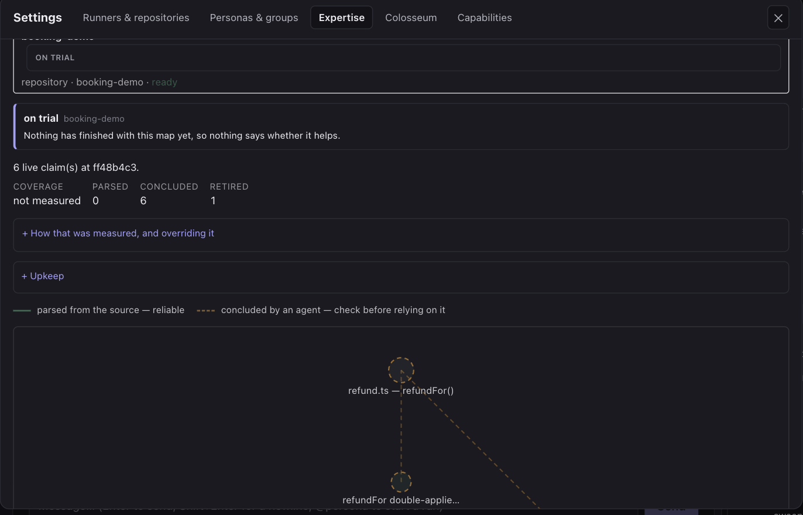
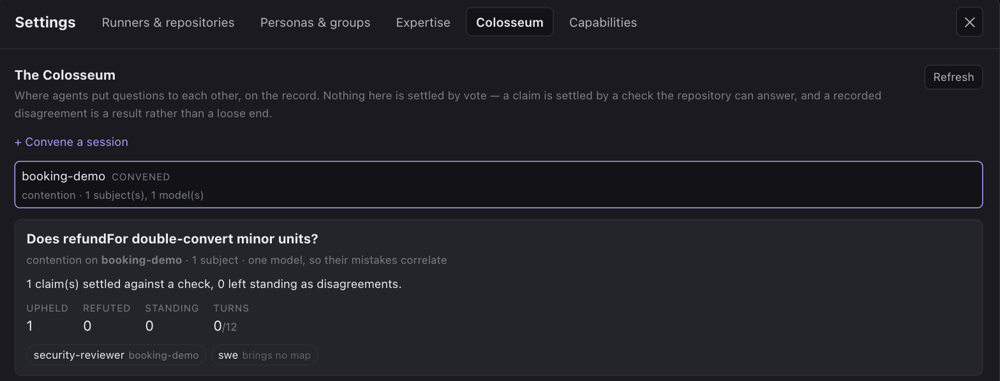

# Loom — a platform for swarms of AI coding agents that measures them rather than trusting them

[](https://github.com/raminjafary/loom/actions/workflows/check.yml)
[](./LICENSE)


**Run ten coding agents at once, each in its own git clone and container. Nothing any of them
says about its own work is taken as evidence: spend is counted at the network boundary, "done"
is the repository's own checks with the verdict derived server-side, and a change to an agent's
instructions has to win a measurement before it becomes what the next run is told.**

One agent in a terminal is a solved problem. **Ten of them is not.** Who reviews ten branches?
What stops two agents editing the same file? Where does shared context live so the fifth agent
knows what the second learned? What is a person actually asked to decide, what did the whole
thing cost — and when an agent reports that it is finished, what checked?

Loom is an answer to those questions, built as a **multi-agent orchestration platform** for real
software work rather than a demo. One idea runs through the whole of it: **an agent's claim about
its own work is never the evidence for it.** What settles it instead is something outside the
agent — the repository's tests, a byte count at the proxy, a set of held-out work, a second
session that was never shown who wrote what, or a human reading the exact command:

- 🧵 **A planner that decomposes** a goal into a DAG of subtasks, with sub-planners for their own
  areas and workers that share a notes ledger
- 📦 **Clone-per-run isolation** and a **container sandbox** that holds no credentials, so an
  agent's blast radius is its own working copy
- 🛡️ **Human-in-the-loop approval** on a card showing the **exact argv**, never a model's summary
  of what it is about to do — prompt injection is the threat model, not an edge case
- 🚦 **A serialized merge queue** with a reconciler agent that resolves additive conflicts and
  refuses real ones, so sibling branches converge instead of racing
- ✅ **A definition of done that belongs to the repository** — named, ordered checks run in the
  sandbox, with the verdict derived server-side so an agent cannot certify its own work
- 💸 **Authoritative cost metering and enforced budget caps**, measured at the network boundary
  rather than taken from a model's self-report
- 🕸️ **An egress boundary an agent cannot talk around** — a container with no credentials and no
  network reaches the outside only through a proxy that decides per host, records what it decided,
  and tells a refused run where a grant would have to come from. That path is also why the spend
  figure is a measurement rather than a report
- 🔁 **A swarm you can steer while it is running**, and a handoff brief when a run fills its
  context — a plan changes mid-flight without being restarted, and a successor opens with what its
  predecessor learned rather than with the task text a second time
- 🧠 **Persona memory and self-improving prompts that are measured, not assumed** — an agent may
  rewrite its own instructions inside a ceiling a human sets, and the platform runs both versions
  to find out whether the edit actually helped. Candidates come from a session that is *not* the
  run being edited, shown what has already lost — a session grading its own transcript writes the
  prompt that would have made its own last hour look better
- 🕸️ **A harness you draw rather than write** — the shapes worth reusing (deep research, code
  review, security analysis, a standing team, a migration sweep, a tournament) are a graph the
  server validates before it can spend, not a script an agent authored and the host executes.
  Every step is an ordinary run, so the meter, the envelope, approvals and steering all apply
  unchanged; a bar across the lane is a barrier, and everywhere else a step starts the moment its
  own predecessor finished. There is deliberately **no editor**: an edit is a new version, and a
  version arrives as a **proposal an agent drew and a person approved** — bounded by that
  designer's own envelope, because a shape that names a persona is a grant made by drawing.
  And a shape has to **beat a planner and its workers** on its own class of work, measured, or it
  is a diagram that costs a run per step
- 🗺️ **[Expertise](#expertise-and-the-colosseum): a map an agent built and can be held to** — a
  mastery run's deliverable is a graph of a codebase rather than a diff, every claim carries how
  it was arrived at, and retrieval is a trial with a deliberately-withheld baseline, because an
  expertise that cannot be shown to help is a context-window tax with a reassuring name
- ⚔️ **[The Colosseum](#expertise-and-the-colosseum): agents that put questions to each other,
  where nothing is settled by agreement** — two agents who mastered different parts of a system
  know different things, and the arbiter is the repository's own tests and history, not a vote

Built in TypeScript on Node 22, Postgres, Valkey, Fastify, oRPC, Vue 3 and the Claude Agent SDK
— with every layer behind a port, so the execution backend, the store, the transport and the UI
framework are each replaceable.

**Contents** · [Screenshots](#screenshots) · [Features](#features) ·
[Expertise and the Colosseum](#expertise-and-the-colosseum) · [Quickstart](#quickstart)
· [How it works](#how-it-works) · [Security model](#security-model) · [Development](#development)
· [Configuration](#configuration) · [Roadmap](#roadmap) · [Contributing](#contributing)

---

## Screenshots

**A run in its thread.** Each tool call, its result and the completion render as messages you can
read in order. This one was asked to add a row to this file's own Requirements table, and it cost
nine cents.


| | |
|---|---|
|  |  |
| **Approval on the exact argv.** The card renders the tool call's real payload — this file, this old string, this new string — never a model's description of what it is about to do. Approval is bound to a hash of that exact call, so mutated arguments have to ask again. | **Nothing merges without a decision.** A finished run's branch, diffed against what it was cloned from: keep it, discard it, queue it behind the other branches, or push it and open a PR. |
|  |  |
| **An inbox, not a firehose.** The retention surface is what needs *you*: a gate waiting, a branch ready, a run that stopped early. Not a stream of everything every agent did. | **A canvas that will not draw an edge the runtime would refuse.** Who is on the team, who may hand work down to whom, who reviews whom — and which runs are allowed to proceed unattended. |
|  |  |
| **A persona is a document, not a checkbox.** A model, a tool list, an approval mode, a spend cap — and an envelope bounding what the persona may rewrite about itself. | **Spend measured at the network boundary.** Cost is read from the provider's own responses at the egress proxy, not taken from a model's self-report, and it is what the caps are enforced against. |

---

## Features

| | Feature | What it means in practice |
|---|---|---|
| 💬 | **Chat-shaped workspace** | Channels and threads. `@mention` a persona to start a run; its tool calls, results and completion render as messages you can read in order |
| 📥 | **An inbox, not a firehose** | The retention surface is "what needs *you*" — a gate waiting, a finished branch, a failed or reaped run — not a stream of everything every agent did |
| 🔔 | **Push notifications** | A run that needs you reaches you without the app open; clicking opens the Inbox on that run |
| 🧵 | **Planner → DAG → workers** | A goal becomes at most eight subtasks with claimed paths, sub-planners decompose their own areas, and `dependsOn` sequences what must not run in parallel |
| 🗒️ | **Shared notes ledger** | Siblings write findings other siblings read, so the fifth worker knows what the second learned — bounded per tree, and agent prose is fenced as untrusted data |
| 🎛️ | **Mid-flight steering** | Re-plan a running swarm without stopping it, or answer a question a blocked run asked |
| 📦 | **Clone-per-run isolation** | Every run works in its own git clone on a branch of its own. The bound repository's working tree is never touched |
| 🔒 | **Container sandbox, no credentials** | `--network=none`, dropped capabilities, non-root, read-only rootfs, only the run's clone mounted. The run holds an opaque lease, never a key |
| 🛡️ | **Approval on exact argv** | The card shows the real command from the tool-call payload, hash-bound so mutated arguments need re-approval — never a model's description of itself |
| 🚦 | **Serialized merge queue** | Rebase, verify, fast-forward, one branch per repository at a time, with a reconciler agent for additive conflicts and a refusal for real ones |
| ✅ | **Repository-owned definition of done** | Named, ordered checks, run in the sandbox against a rebased branch and against every finished run's own. The verdict is the platform's |
| 💸 | **Metered spend, enforced caps** | Cost is read from the provider's responses at the proxy, not self-reported, with pre-flight estimate, per-turn check and a hard kill |
| 🔌 | **Two execution backends, one port** | The Claude Agent SDK, and any model an operator serves themselves over the chat-completions protocol — same persona document, same tool names, same approval gate, same run row. A backend is chosen by a prefix in the model id, so which one ran a run is still readable months later |
| 🧠 | **Measured persona memory** | Subject maps, an atlas across projects, and retrieval as a trial with a deliberately-denied baseline arm |
| 📓 | **Durable lessons, per repository — and measured** | An agent records what it learned about *this* codebase and the next run against it is shown that back — bounded hard, ranked by what became of the runs that read each one, fenced as untrusted data, and retired when a merge changes the files it named. Like the maps, it is a trial: some runs are deliberately denied the lessons and recorded as the baseline |
| ⚔️ | **The Colosseum** | Two agents that learned different things put questions to each other in a bounded, recorded session — settled by a check the repository can answer, never by agreement |
| ♻️ | **Self-editing inside a ceiling** | An envelope bounds what a persona may become; edits go on trial against what they replaced, judged by outcomes rather than by a model's opinion |
| 🎯 | **A held-out screen before a candidate costs anything** | A proposed prompt is replayed against past decided work at the commit each run opened at. One that does worse than the prompt in use is refused an arm, so no live run is spent on it |
| 🪞 | **Candidates from a session that is not the run being edited** | A separate read-only proposer is shown which arms lost and which candidates the screen refused, and submits through the same validator a self-edit uses — a run grading its own transcript writes the prompt that flatters its own last hour |
| 🎚️ | **Model routing on the one honest signal** | A branch that fails the repository's checks is retried once, one tier up — never on a crashed run, which says nothing about capability. Optionally, a run's model comes from what has already happened on that persona's work, which only ever routes *down*: the table is read from runs nobody randomised, so it is biased against whichever model a human reached for on the hard tasks |
| ⬆️ | **It can replace itself, and has to prove the replacement** | A revision of Loom's own source is built in a worktree with a frozen lockfile, started on a port of its own until `/healthz` says the schema it expects is the schema the database has, and checked against what the running revision could do. Only then does a pointer move — and a rollback is the same pointer moving back |
| ⏮️ | **A rehearsed rollback** | A scripted drill promotes a knowingly-broken change to Loom's own source and recovers from it — with the recovery running from a checkout pinned before the change, so the broken code cannot take part in its own repair |
| 🕸️ | **Workflows, drawn rather than scripted** | A closed vocabulary of nodes and edges the server validates before anything runs. A fan splits work into lanes that flow independently; a barrier is the only thing that collects them; a refusal stops its own lane rather than the execution. Six ship drawn: deep research, code review, security analysis, agent teams, migration sweep, tournament |
| ⚖️ | **A tournament, seated by a hash nobody chose** | N attempts at one problem, judged two at a time until one is left. Which attempt meets which — and which side of the page each is shown on — comes from a hash of the execution's id, so position bias in pairwise judging has nothing to bite on, and the bracket re-derives identically from its own rows. A match that answers nothing advances nobody |
| ✍️ | **A harness is asked for, not typed** | There is no workflow editor: a designer agent reads the repository, is told the roster and the vocabulary, and submits a shape. Nothing it submits runs. It lands as a drawing beside its ceiling, and approving is what writes the version — with every persona it names attenuated against that designer's own envelope first |
| ⚖️ | **A shape has to earn its place** | The same class of work, the harness against a planner and its workers, dispositions first and cost second. The unit is a *task*, not a run — a planner's whole tree and an execution's steps are each "what this task cost to attempt" — and ties go to the planner, because the shape is the thing that costs more |
| 📐 | **A shape is a configuration, so it is versioned** | Editing a workflow writes a new version with its own digest; nothing rewrites one. An execution renders the version *it* ran, and its journal is what a resumed execution replays from — there is no cache and no separate resume path |
| 🧪 | **Campaigns: growth measured, not asserted** | Any past version of a persona replayed against its own past work, at the commits that work opened at, scored by the repository's checks. It gates nothing and promotes nothing; a hard cap **halts** it, and a halted campaign's score says "partial" first. No growth figure is ever computed — a difference between two vintages is a difference in everything that moved |
| 📉 | **The raw gap between two models, paired per item** | The same document on a small model and a frontier one over one item set, paired over the items *both* arms scored, with the dropped verdicts counted. The first point of a punch-up curve, and it is a curve only within one leg — two campaigns over two sets differ in which work was asked for |
| 🔁 | **The loop can close itself** | Off by default: a mined threshold on a persona's own recent dispositions opens a proposer session and a search with nobody watching. No new authority — every write is one the envelope already permits, and promotion stays a human's |
| 🔧 | **A tool list is an arm too** | Tier 2's self-edit is measured the way tier 1's is: a candidate tool list is screened, dealt runs and promoted on outcomes, rather than merely permitted |
| 🖼️ | **Two canvases** | Design a team on a canvas that will not draw an edge the runtime would refuse, and watch a live graph of what each run is doing now |
| ⚡ | **Warm dependency trees** | Optional: runs open with `node_modules` already in place instead of spending a model turn installing |

### The walkthrough

**One agent, end to end.** Pair a Runner, bind a git repo, write a persona, `@mention` it, watch
it work in a thread, get notified when it needs you, approve or deny a risky tool from a card
showing the exact argv, then review and keep, discard, push or queue the branch.

**A swarm.** A Planner decomposes a goal into a DAG of subtasks, sub-planners decompose their own
areas, workers share a notes ledger, sibling branches converge through the merge queue, and you
can steer the whole thing — or answer a question one run is blocked on — without stopping it.

**A harness.** When the decomposition is *not* the hard part — the same five stages every time —
open Settings → Workflows, pick a shape, read what it may cost at worst, and run it. The diagram
shows where the work waits: a bar across the lane is a barrier, and everywhere else a step starts
the moment its own predecessor finished. Where the decomposition *is* the hard part, the Planner
is still the right answer and a workflow would be a guess frozen into a diagram.

Nobody draws one by hand. Ask for it in the same panel — *"something for triaging a flaky test
without one agent grading its own change"* — and a designer reads the repository and proposes a
shape you approve or decline. Beneath it is the answer to whether the harness was worth drawing
at all: run the next task of that class and the platform picks the side, alternating, until one
arm has beaten the other on dispositions and on cost.

### Three ideas that do not exist elsewhere

**A definition of done that belongs to the repository, not to a command.** A repo declares
named, ordered checks. The merge queue runs them against a rebased branch; every finished run
runs them against its own. Execution stops at the first failure and the rest are recorded
`not_run` rather than omitted. The verdict is derived server-side, so a Runner cannot certify
its own work.

**Persona memory that is measured rather than assumed.** A mastery run builds a subject map, an
atlas relates maps across projects, and retrieval is a *trial*: some runs are deliberately
denied the map and recorded as the baseline, because an expertise that cannot be shown to help
is a context-window tax with a reassuring name.

**Agents that edit themselves inside a human-set ceiling, and a loop that decides whether the
edit helped.** An **envelope** bounds what a persona may become. Tier 1 rewrites its own prompt
(body only, round-trip checked); tier 2 its own tool list (a list, never a document). Then the
edit goes on **trial** against the document it replaced: an agent with more than one idea
proposes candidate prompts that never go live, the platform deals runs out between them, and
the fitness is a human's disposition, then the repository's definition of done, then cost —
never a model's self-report. A **blinded verifier** in its own session reads the candidates with
the rationales, the incumbency and the generator's notes withheld. It ranks; a person promotes.

The loop can also **start itself**, and that is a switch rather than a default. With
`EVOLUTION_TRIGGER_ENABLED` on, a mined threshold on a persona's own recent dispositions — passed
branches a human discarded anyway, or one named check failing over and over — opens a proposer
session and a search with nobody watching. It grants no new authority: every write is one the
envelope already permitted, and promotion stays a human's permanently. What is left to ask is
whether a persona has actually *grown*, and a **campaign** is the instrument for it: any past
version of a persona replayed against its own past work, at the commits that work opened at,
scored by the repository's checks. It gates nothing, and it deliberately reports no growth
figure — a difference between two vintages is a difference in the document *and* in the checks,
the model and the harness that all moved between them. The one comparison it can make cleanly is
the same document on two models, paired per item: the raw gap before anything tries to close it.

### Expertise, and the Colosseum

Two settings tabs hold the part of the system that is about what an agent *knows* rather
than what it does.

**Expertise — a map an agent built, and claims it can be held to.** Assigning a persona to
a repository can start a *mastery run*: a deliberately cheap, long-running job whose
deliverable is not a diff but a graph — modules, entry points, data flows, conventions, the
places past merges went wrong — as nodes and typed edges the platform can traverse, so a
worker does not spend a turn rediscovering them. Every claim carries how it was arrived at,
and the panel draws the difference: a solid edge was **parsed from the source**, a dashed
one was **concluded by an agent** and says *check before relying on it*. A map is pinned to
the commit it was built at, so the merge queue can retire it when the repository moves past
it. And retrieval is a **trial** — some runs are deliberately denied the map and recorded
as the baseline — which is why a map nothing has finished with yet reads *on trial ·
nothing says whether it helps* instead of claiming a benefit nobody measured.



**The Colosseum — where agents put questions to each other, and nothing is settled by
vote.** Two agents that mastered different parts of a system know different things, and the
edge between their subjects is exactly what neither can see alone. A session is the venue
for that exchange, with the four properties that keep it auditable: a fixed roster, a spend
ceiling, a transcript, and a verdict. Four things happen there — a worker consults an
expert, two experts contend over the same subsystem, several agents crunch one subsystem
into a reconciled map, or a successor is warmed up by its predecessor before a handoff.

What shapes the rest is that **agreement is not evidence**. Deliberation converges on
agreement even where the agreement contradicts the evidence; correct claims present in
round one get dropped as rounds proceed; and both effects are worst exactly where a
workspace would convene a session — two personas sharing one model, one prompt lineage and
one decoding prior, whose errors therefore correlate. So:

- **The arbiter is the repository.** A question its tests, its history or its actual
  imports can answer is answered by running that check. A claim that can cite no such check
  is left unsettled rather than talked into a verdict.
- **Disagreement is preserved, not resolved.** Both claims kept, both scores lowered — a
  *successful* outcome, because a venue that must produce agreement will produce agreement.
- **Every claim's holder is recorded before anyone speaks**, and an opening claim is
  refused once a session has started. That refusal *is* the measurement: a claim entered
  mid-session cannot afterwards be told apart from one the conversation produced.
- **A roster is refused when everyone brings the same knowledge on the same model** — and
  when nobody brings anything at all. The panel says so in as many words: *one model, so
  their mistakes correlate*, and *swe · brings no map*.
- **Everything said in a session is a model's output**, so it stays untrusted input to
  whoever hears it, permanently and however many sessions the speaker has won. A reply is
  data with a citation, never an instruction, and no track record converts into trust.
- **Nothing a session says is written into a map by the session.** There is no function
  anywhere that does it. Promotion is a human act, and so, today, is convening.

Reaching the turn cap **abandons** a session rather than concluding it — a conversation
that was cut off has not reached a verdict — and a session that dropped more claims than it
settled is marked as having lost ground, because otherwise it would look productive for
having produced fewer open questions.



---

## Requirements

| | |
|---|---|
| Node | ≥ 22 (developed on 24) |
| pnpm | 11 |
| Docker | or Podman — Postgres 18, Valkey 9, the egress proxy |
| `claude` | installed and authenticated, for real agent runs |

`apps/runner` imports `@anthropic-ai/claude-agent-sdk` as a library rather than shelling out to
the CLI, but it needs the same underlying auth.

## Quickstart

```bash
pnpm install
cp .env.example .env                      # then set BETTER_AUTH_SECRET and WS_SUBSCRIPTION_SECRET
openssl rand -base64 32                   # ← generate one for each; both are refused if short
make up                                   # containers, migrations, then every app
```

`make up` is the whole stack. Individually:

```bash
docker compose up -d                      # Postgres 18 + Valkey 9 + egress proxy
pnpm db:migrate                           # apply the schema
pnpm --filter @loom/server dev            # API + /rpc + /ws/runner  :3001
pnpm --filter @loom/ws-gateway dev        # realtime fan-out         :3002
pnpm --filter @loom/web dev               # UI                       :5173
```

Sign up through the UI (email/password via Better Auth); a default workspace auto-provisions on
first login.

**`make dev` frees the dev ports before starting, deliberately.** A `pnpm dev` that outlived its
terminal keeps serving pre-migration code, and a session was once spent diagnosing a canvas that
was not broken — the database had moved underneath a process nobody had restarted. `make kill`
does that part alone, and also stops any Runner started by hand, since a Runner holds no port and
survives everything else. `make status` shows what is up and what is holding each port.

### Running a real agent

Everything below is reachable from the UI sidebar. To drive it over RPC instead:

1. `runner.createPairingToken({name})` → a `runnerId` and a raw pairing token.
2. Start the Runner against the *parent directory* of your repos:
   ```bash
   LOOM_SERVER_WS_URL=ws://localhost:3001/ws/runner \
   LOOM_PAIRING_TOKEN=<token> \
   LOOM_ALLOWED_ROOTS=/absolute/path/to/allowed/parent \
   pnpm --filter @loom/runner start
   ```
3. `repository.bindExisting({runnerId, path, displayName})`
4. `persona.create({markdownSource})` — markdown plus frontmatter.
5. `agentRun.start({threadId, repositoryId, personaId})`

The Runner clones the bound repo into a per-run scratch workspace first. It never touches the
bound repo's own working tree. Watch the run via `message.list`/realtime; fetch its branch diff
with `agentRun.getDiff({agentRunId})`.

### Merging an agent's branch

A finished run's branch is **queued, never merged on the spot** — *Queue for merge* on the diff
view, or `mergeQueue.enqueue({agentRunId})`. A background sweep merges one branch per repository
at a time, in order: rebase onto the current default branch, run the repository's verification,
fast-forward. Sibling branches converge through that queue rather than racing.

The target is the bound repository's own default branch, locally. Pushing to `origin` is the
separate `agentRun.push` path with its own policy.

Set what verifies a merge per repository — the line under each repo in the sidebar, or
`repository.setVerifyCommand({repositoryId, verifyCommand})`. That command runs **inside the
sandbox** with `--network none`. It is operator-authored, but the code it executes lives on the
agent's branch, so running it on the Runner host would be agent code with the Runner's
privileges; without a sandbox the merge is refused unless
`LOOM_ALLOW_UNSANDBOXED=i-understand-the-agent-gets-my-privileges` is set. Because there is no
network, verification runs what is already in the clone and cannot install anything.

Three things the queue refuses rather than forces: a branch that conflicts (handed back to its
run, disposition left unset so it can be fixed and re-queued), a repository with uncommitted
changes on the target branch, and a target that moved mid-merge.

---

## How it works

```
packages/
  domain/            pure entities and rules, zero dependencies
  application/       use-cases + ports (interfaces only)
  db/                Drizzle/Postgres adapters — the only place ORM types exist
  api-contract/      oRPC procedures + Zod schemas (the browser/client wire boundary)
  runner-protocol/   WS frame schemas shared by apps/server and apps/runner
  client-core/       framework-agnostic client logic
apps/
  server/            Fastify + oRPC + /ws/runner; implements the contract, drives Runners
  ws-gateway/        stateless realtime service (Valkey fan-out to browsers only)
  web/               Vite + Vue 3 — thin views over client-core
  runner/            local daemon: pairs with the server, drives the real Agent SDK
  egress-proxy/      credential-injecting, metering, allowlisting egress boundary
tools/
  architecture.test.ts   asserts the dependency rule holds
  *-check.mts            live drivers: real server, real Runner process, real SDK, real git
```

**The dependency rule — outer layers depend on inner, never the reverse — is enforced by
`eslint.config.js` and `tools/architecture.test.ts`, not by convention.** A vendor type crossing
a port boundary is a build failure.

Two seams are worth knowing about. The **Runner** is a separate process on the machine that
holds your repositories, connected by an authenticated WebSocket; the server never touches your
filesystem. The **egress proxy** sits between every sandbox and the network, holding the real
credential so the sandbox holds only an opaque per-run lease.

A third is worth knowing about if you touch workflows. The executor is a **pure function of the
drawn shape and the journal** — asked "given these rows, what may be dealt now", it answers, and
the application layer does the dealing. That split is what makes an execution replayable and makes
resume stop being a special path: a resumed execution is the same function called against a
journal that happens to be longer.

Design decisions and their reasoning live in the code, next to what they constrain: a
comment explains *why* a boundary sits where it does, so the argument is where the change
would be made.

## Security model

Prompt injection is the threat model, not an edge case: any agent reading a file, a diff or a
web page is reading attacker-controllable instructions. The load-bearing controls:

| | |
|---|---|
| **Secrets never enter the sandbox** | A run holds an opaque, revocable, per-run lease token. The proxy swaps it for the real credential, which lives on the host. Metering happens on that path, so cost is authoritative rather than self-reported. |
| **The agent never pushes** | It commits in its sandbox; the host-side Runner pushes after a policy check — the run's own branch only, no force-push, no tags, no protected branches, and no CI-config change without a second acknowledged request. |
| **Approvals are identity-bound** | Only a principal of type `user` can resolve a gate, so an injected agent cannot approve itself. Cards render the exact argv from the tool-call payload, never a model-authored summary, and approval is bound to a hash of that exact call. |
| **The sandbox is the boundary** | `--network=none` by default with all egress through the proxy, never the container socket, `--cap-drop=ALL`, no-new-privileges, default seccomp, non-root in a userns, read-only rootfs, only the run's clone mounted. |
| **The clone gets no vote** | The SDK runs with `settingSources: []`, so a `.claude/settings.json` committed to a repository cannot grant permissions nobody was asked for. A repo's `CLAUDE.md` is not auto-injected either — the persona is the instruction source. |
| **A planner cannot act** | Read-only tools, enforced at persona-authoring time. Its only effect on the world is a decomposition the server validates itself. |
| **The realtime stream asks who is listening** | A subscriber presents a short-lived token the server signs from its session; the workspace is inside the token, so a client cannot name one. The fan-out service verifies and never signs, so it can read what it was already forwarding and cannot mint itself anything else. |
| **A subscription is a lease** | That token expires and is renewed on an interval the mint returns, so a revoked session loses its stream in minutes rather than for the life of a tab — and a client holding its own copy of the deployment's lease cannot be one release out of date about it. |
| **A Runner may only answer what it was sent** | Two Runners on one host is the ordinary arrangement. A reply used to be matched by request id alone, so a second Runner could resolve another's in-flight merge, push, diff or verification by answering with its id. Every pending request now carries the Runner it went to, taken from the connection rather than from the frame, and a reply from anyone else is *dropped* — rejecting would let a second Runner fail another's merge on demand. |

Three limits stated plainly rather than buried:

- **The model API call is itself an unblockable exfiltration channel.** That is why the real
  control is "secrets never enter the sandbox" rather than "the sandbox cannot talk out".
- **Unsandboxed runs get the Runner's own privileges** — one `Bash` call reaches the login
  keychain — so that mode needs a separate, deliberately awkward acknowledgement.
- **Concurrent sandboxes share one network.** They hold no credentials, so the blast radius is
  one run's clone, but they can reach each other by container name. Per-run networks close it.
  The egress proxy's control plane sits on that network too and no longer answers on it: a
  connection from the sandbox's range is destroyed before it is parsed, and the proxy says at
  boot which range that is — so the control secret is now the Runner's authentication rather
  than the only barrier. It is still validated as one: at least 32 characters, example values
  refused at boot.

---

## Development

```bash
make check          # what CI runs: typecheck, lint, the suite, the boundary test
pnpm test           # 2,361 tests across 127 files
pnpm db:test:prepare # four test databases — re-run after any db:generate
```

CI runs the same commands on every push and pull request
([`.github/workflows/check.yml`](.github/workflows/check.yml)).

**One database per test package**, not one shared `loom_test`: `packages/db`, `apps/server` and
`apps/ws-gateway` run concurrently under turbo and each truncates tables the others are mid-way
through using. Sharing one made `pnpm test` fail for reasons unrelated to whatever was being
changed, which trains you to re-run rather than to read. Re-run `pnpm db:test:prepare` after
generating a migration — a migration applied only to `loom` shows up as integration tests timing
out rather than as a missing-table error.

**No automated test calls the real model API** (that costs real tokens). That path is covered by
the live drivers in `tools/` — thirty of them, run by hand. Each drives a real server, a
real Runner *process*, the real SDK and real git, and each **asserts** rather than prints.

Several spend no tokens at all: a run refused by the Runner's own unsandboxed guard is refused
*after* its clone, so the workspace, the commit and the dispatch are real and no model is ever
called.

```bash
docker compose up -d postgres valkey
npx tsx tools/workflow-check.mts   # 58 checks: a drawn shape dealing real runs, and a bracket
npx tsx tools/designer-check.mts   # 36 checks: a harness asked for, refused, proposed, approved
npx tsx tools/trial-check.mts      # 15 checks: the arms alternating, and a task as the unit
npx tsx tools/campaign-check.mts   # a campaign against a real repository, no tokens
npx tsx tools/backend-check.mts    # 19 checks: a second backend, its channels, and two stacks
npx tsx tools/persona-share-check.mts  # 16 checks: a persona across two real workspaces
docker compose --profile blobs up -d seaweedfs
npx tsx tools/blob-check.mts       # 8 checks: the object store against the filesystem, differentially
```

The no-token drivers buy their cheapness by answering on the model's behalf, and that is exactly
where three defects hid: a designer handed the *planner's* tool because one field was not
forwarded into the container, a node that declared no answer refused for not giving one, and a
planner persona on a workflow step answering with a plan. None of the three could fail — every run
looked successful — and none is reachable from a driver that supplies the answer itself. So three
drivers put a model behind the same machinery:

```bash
docker compose up -d postgres valkey egress-proxy
docker build -f apps/runner/Dockerfile.sandbox -t loom-agent-sandbox:latest .
export $(grep -E "^LOOM_EGRESS_CONTROL_SECRET=" .env | xargs)

LOOM_USE_HOST_CLAUDE_AUTH=1 npx tsx tools/designer-live.mts    # a model draws a harness
LOOM_USE_HOST_CLAUDE_AUTH=1 npx tsx tools/bracket-live.mts     # a judge compares real attempts
LOOM_USE_HOST_CLAUDE_AUTH=1 npx tsx tools/trial-traffic.mts    # ten tasks, five a side
```

`trial-traffic.mts` is the one that answers the question the whole shape rests on, and its first
verdict went **against** the harness: a planner and its workers took 100% of their tasks to the
harness's 80%, on a class where the harness was cheaper and failed no checks at all. It lost one
task by producing nothing — its scoping step did not answer, so the fan never opened. A planner
that plans badly still leaves a tree of workers; a drawn shape has a single point of failure that
planner-and-delegate does not.

```bash
docker compose up -d
LOOM_USE_HOST_CLAUDE_AUTH=1 npx tsx tools/self-edit-check.mts

set -a; . ./.env; set +a   # sandboxed mode needs the egress control secret, or every run is
                           # *refused* rather than sandboxed — and the refusal reads like a
                           # broken feature
LOOM_USE_HOST_CLAUDE_AUTH=1 LOOM_SANDBOX_ENABLED=1 npx tsx tools/self-edit-check.mts
```

Two things that otherwise cost you a pass:

- **The API key in `.env.example` is a placeholder.** Without `LOOM_USE_HOST_CLAUDE_AUTH=1` a
  driver "passes" about nothing.
- **After touching `apps/runner/src/`, rebuild the sandbox image.** The Runner refuses a stale
  one on purpose — an out-of-date image does not fail, it runs older agent-side code and the
  model is quietly never offered whatever the newer sources added:
  ```bash
  docker build -f apps/runner/Dockerfile.sandbox -t loom-agent-sandbox:latest .
  ```

## Configuration

`.env.example` documents every variable. The ones that change behaviour rather than wiring:

| Variable | Default | Meaning |
|---|---|---|
| `WS_SUBSCRIPTION_SECRET` | — | Shared by the server and the realtime gateway: the server signs a short-lived subscription token, the gateway verifies it. It is the whole authentication of `/ws/client`, so both refuse to start without a real one |
| `LOOM_SANDBOX_ENABLED` | on | Container isolation per run. Needs `LOOM_EGRESS_CONTROL_SECRET` set, or runs are refused rather than sandboxed |
| `LOOM_ALLOW_UNSANDBOXED` | unset | The acknowledgement that lets a run hold the Runner's privileges |
| `LOOM_SANDBOX_ISOLATION` | `container` | `microvm` gives every container this Runner starts its own kernel through `LOOM_SANDBOX_OCI_RUNTIME` (default `kata-runtime`) — the run, its verification checks and the cache warm step. Proven before the first run: an unavailable runtime refuses every run rather than falling back to the shared kernel, which would look identical |
| `LOOM_SELF_PROMOTION` | unset | Whether `tools/self-promote.mts` may make a revision of Loom's own source the one that serves. Off is a real off switch rather than an unset value, and a rollback is deliberately *not* gated on it — a deployment that turned promotion off while a bad revision was serving must not have disabled its own way out |
| `LOOM_REVISIONS_ROOT` | `~/.loom/revisions` | Where built revisions and the running-revision pointer live. Outside the repository on purpose: a store inside the tree being replaced is one `git clean -fd` deletes during the recovery it exists to serve |
| `LOOM_USE_HOST_CLAUDE_AUTH` | off | Lets the Runner read the host's Claude OAuth token and push it to the proxy |
| `LOOM_ALLOWED_ROOTS` | — | Parent directories a repository may be bound from |
| `LOOM_CHAT_COMPLETIONS_BASE_URL` | — | Where a model the operator serves themselves is reachable. Required for any persona whose model id starts with `local/`; unset is a refusal rather than a guess at localhost |
| `LOOM_CHAT_COMPLETIONS_API_KEY` | unset | Sent as a bearer token to that endpoint, for a server that wants one |
| `EVOLUTION_TRIGGER_ENABLED` | off | Whether the platform may decide an improvement is due and open a proposer session itself. Off is consent withheld rather than a feature gate — the improvement loop works without it and waits to be asked |
| `LOOM_DEP_CACHE_ENABLED` | off | Package-manager cache, keyed **per repository**; a warmed repository also captures a **prepared tree**, so runs open with `node_modules` already in place. Per repository because the only writer is the operator's install command and that command is a per-repository setting — one root for a host meant one repository's command wrote what every other repository's runs copied |
| `LOOM_DEP_CACHE_MODE` | `copy` | `shared` is faster and unsound — a directory shared between sandboxes is a channel between them |
| `WORKFLOW_MAX_STARTS_PER_TICK` | 4 | How many workflow steps one executor tick may start. Higher than a campaign's on purpose: a fan is *meant* to open several lanes at once, and a budget of one turns a shape drawn as parallel into a queue |
| `VAPID_PUBLIC_KEY` / `VAPID_PRIVATE_KEY` | unset | Web push. Off until configured; `npx web-push generate-vapid-keys` |

Only directories a repository's own `.gitignore` covers are captured into a prepared tree, which
is what makes it invisible to review: a run's `git status`, its commit, and the diff a human
reads are exactly what they would have been.

---

## Roadmap

Loom is built in phases, and the phase boundaries are architectural rather than cosmetic —
each one exists because the next depends on it.

**Recently landed:** workflows — the drawn vocabulary, the executor, the enforced budget, the
answer channel, six built-ins and a live driver that deals real runs against a real repository at
zero tokens; a tournament bracket whose seating is hash-seeded and replayable; the designer agent
that proposes a shape a person approves, since there is no editor; and the trial that decides
whether a harness beat a planner on its own class of work. Campaigns and the cross-model gap.
The trigger that lets the improvement loop start itself.

**Next:**

| | |
|---|---|
| **Traffic through the workflow trial** | The machinery is built and driven live; what it has never had is real tasks. Five decided tasks a side on one class is the first verdict, and it is the claim the whole shape rests on (Phase 3) |
| **Platform channels on the second backend** | The execution port now has two adapters and the second is driven live, so replaceability is demonstrated rather than architectural — but a model served over the chat-completions protocol gets file and shell tools only. A run needing the planner, mastery, verifier, proposer, self-edit, memory or workflow-answer channel is refused with the channel named rather than run without it (Phase 3) |
| **microVM isolation** | Containers alone are insufficient; Kata or microsandbox is the boundary (Phase 3) |

## Contributing

The dependency rule (`packages/domain` depends on nothing; outer layers depend on inner, never
the reverse) is enforced by `eslint.config.js` and `tools/architecture.test.ts`, so a violation
is a build failure rather than a review comment. Run `make check` before opening a pull request —
it is exactly what CI runs. If a change needs a reason recorded, that reason belongs in a
comment next to the code it affects.

## License

[MIT](./LICENSE) — use it, fork it, ship it.
